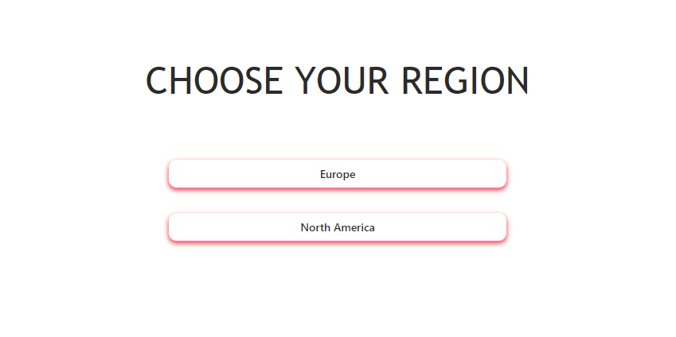
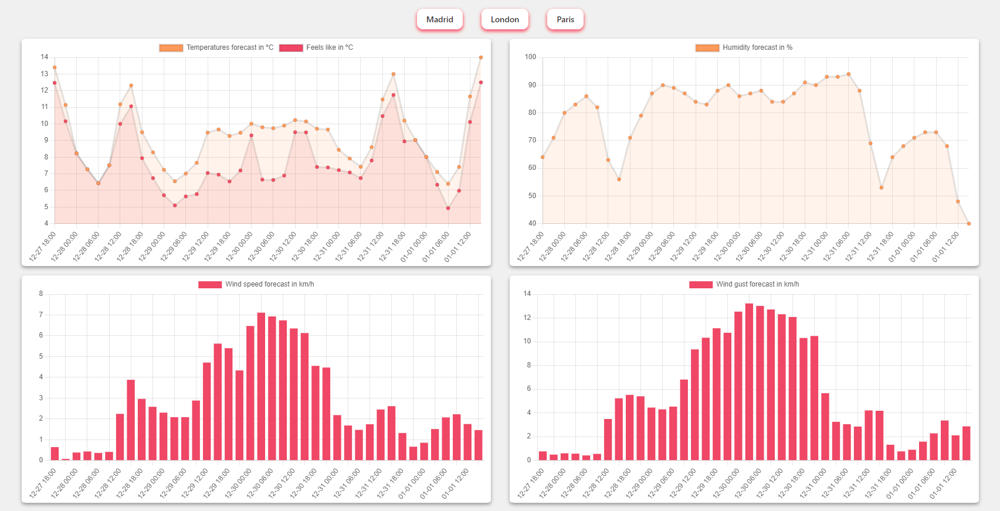

# React Weather App

This project consists of a basic weather graphics app. The app allows the user to select from two regions and displays three cities in each of them.

The data available for the cities' forecast is displayed in graphics.

## Technologies used

- React
- JavaScript
- CSS3
- Bootstrap-React
- ChartJS

## Other sources

- Open weather API <https://openweathermap.org/>
